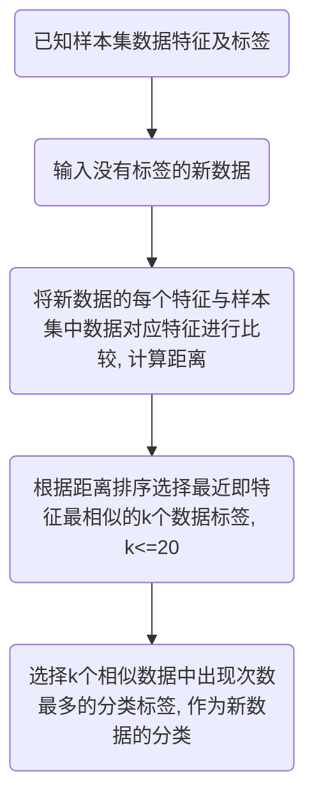
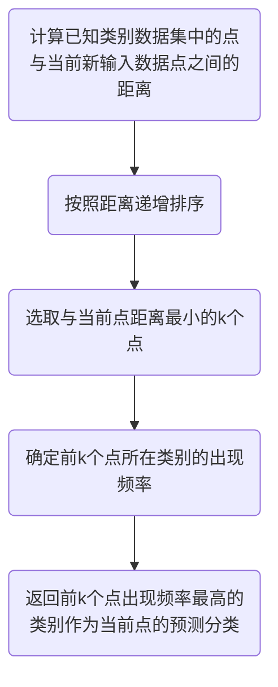

# K-近邻算法

[TOC]

---

## 概述

### 工作原理

存在一个样本数据集合，也称作训练样本集，并且样本集中每个数据都存在标签，即我们知道样本集中每一数据与所属分类的对应关系。

输入没有标签的新数据后，将新数据的每个特征与样本集中数据对应的特征进行比较，然后算法提取样本集中特征最相似数据(最近邻)的分类标签。

一般来说，我们只选择样本数据集中前k个最相似的数据，这就是k-近邻算法中k的出处，通常k是不大于20的整数。 

最后，选择k个最相似数据中出现次数最多的分类，作为新数据的分类。

### 适用范围

* 优点
    * 精度高
    * 对异常值不敏感
    * 无数据输入假定
* 缺点
    * 计算复杂度高
    * 空间复杂度高
* 适用范围
    * 数值型
    * 标称行

## 简单例子

