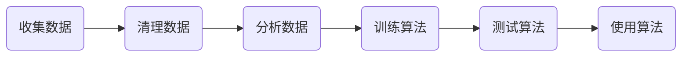

# 机器学习简介

[TOC]

---

## 机器学习分类

* **监督学习** （需要知道目标变量的分类信息）
    * 分类 （离散）
        * k-近邻
        * 朴素贝叶斯
        * 支持向量机
        * 决策树
    * 回归 （连续）
        * 线性回归
        * 局部加权线性回归
        * Ridge回归
        * Lasso最小回归系数估计
* **无监督学习** （无目标变量的类别信息）
    * 聚类
        * K-mean
        * DBSCAN
    * 密度估计
        * 最大期望算法
        * Parzen窗设计

## 流程

​	

